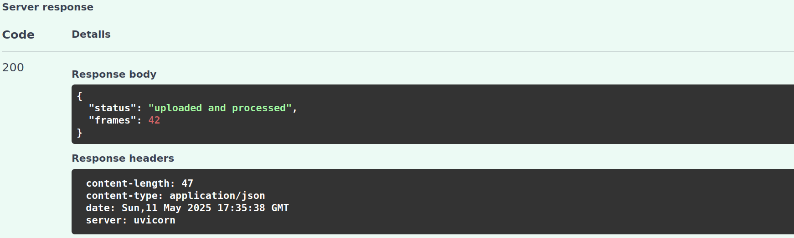
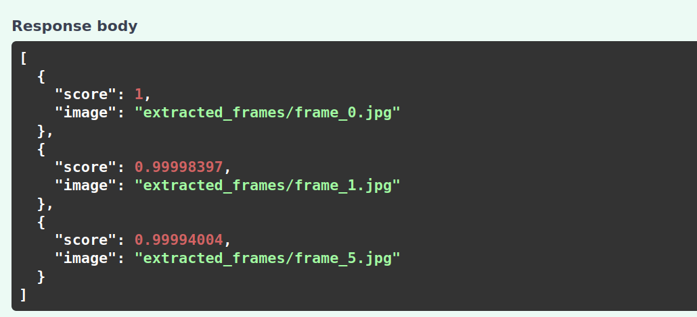

The app was tested with `test_video`, and the frames that were extracted are stored in the **extracted_frames** folder.  
Here is the video to frame status:  

As for the search, `image_0` was used, and here is the result:  

